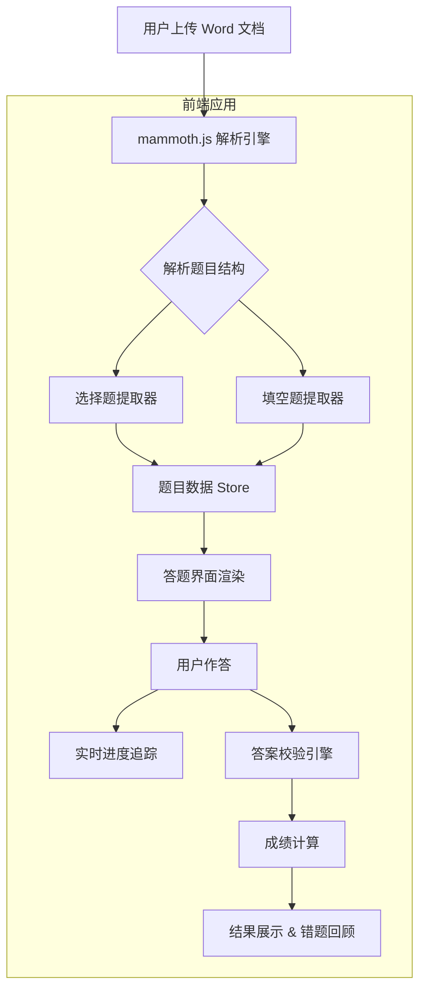

# 项目设计文档 - 智慧答题 (QuizMaster)

## 1. 系统架构



## 2. 数据模型

本项目为纯前端项目，无数据库。数据模型以 TypeScript 接口定义：

```typescript
// 题目类型枚举
enum QuestionType {
  CHOICE = 'choice',       // 选择题
  FILL = 'fill'            // 填空题
}

// 选项
interface Option {
  label: string;           // A / B / C / D
  content: string;         // 选项内容
}

// 题目
interface Question {
  id: number;
  type: QuestionType;
  content: string;         // 题干
  options?: Option[];      // 选择题选项
  blanks?: number;         // 填空题空格数
  correctAnswer: string | string[];  // 正确答案
  explanation?: string;    // 解析
  score: number;           // 分值
}

// 用户答案
interface UserAnswer {
  questionId: number;
  answer: string | string[];
  isCorrect?: boolean;
}

// 答题结果
interface QuizResult {
  totalQuestions: number;
  answeredCount: number;
  correctCount: number;
  wrongCount: number;
  totalScore: number;
  earnedScore: number;
  accuracy: number;
  timeTaken: number;
  details: UserAnswer[];
}
```

## 3. 接口清单

本项目为纯前端，无后端接口。核心功能模块：

- `DocParser.parse(file: File)` — 解析 Word 文档，提取题目数据
- `QuizStore.loadQuestions(questions: Question[])` — 加载题目到状态管理
- `QuizStore.submitAnswer(questionId, answer)` — 提交单题答案
- `QuizStore.calculateResult()` — 计算最终成绩
- `QuizStore.reset()` — 重置答题状态

## 4. 页面清单

| 页面/区域 | 功能描述 |
|-----------|---------|
| 文件上传区 | 上传 Word 文档或使用内置示例题目 |
| 题目导航区 | 显示所有题号，标记已答/未答/正确/错误状态 |
| 题目展示区 | 显示当前题目内容、选项或填空区域 |
| 答题区域 | 选择题点选、填空题输入 |
| 进度追踪条 | 实时显示答题进度 |
| 提交按钮 | 提交全部答案进行评分 |
| 结果反馈区 | 展示成绩、正确率、用时、错题回顾 |

## 5. 示例数据规划

项目内置 10 道示例题目（6 道选择题 + 4 道填空题），涵盖：
- 计算机基础知识选择题
- 编程语言基础填空题
- 数据结构与算法题目

示例数据位于 `frontend/src/data/mockQuestions.ts`，应用启动时自动加载作为默认题库。

## 6. 前端设计规范（遵循 frontend-master 标准）

### 6.1 设计方向
- 美学风格：**编辑排版 (Editorial)** × **极简克制 (Minimal)** — 以出色的排版和清晰的层次感打造专注的答题体验
- 设计关键词：专注、清晰、学术、现代、高效
- 情绪参考：高端在线考试平台、学术期刊排版

### 6.2 色彩体系
- **主色 (Primary)**：`#4338CA` (Indigo 700) — 按钮、导航高亮、链接
- **辅色 (Secondary)**：`#0EA5E9` (Sky 500) — 进度条、信息提示
- **强调色 (Accent)**：`#F59E0B` (Amber 500) — 当前题目高亮、警告
- **中性色阶梯**：
  - 50: `#F8FAFC` / 100: `#F1F5F9` / 200: `#E2E8F0` / 300: `#CBD5E1`
  - 400: `#94A3B8` / 500: `#64748B` / 600: `#475569` / 700: `#334155`
  - 800: `#1E293B` / 900: `#0F172A` / 950: `#020617`
- **语义色**：
  - Success: `#10B981` — 答对
  - Warning: `#F59E0B` — 未答
  - Error: `#EF4444` — 答错
  - Info: `#3B82F6` — 提示
- **60-30-10 法则**：60% 浅灰底色 / 30% 白色卡片 / 10% 主色强调

### 6.3 字体体系
- **标题字体**：`Noto Serif SC`（思源宋体）— Google Fonts，学术庄重感
- **正文字体**：`Noto Sans SC`（思源黑体）— Google Fonts，清晰易读
- **等宽字体**：`JetBrains Mono` — 代码/填空输入
- **字号阶梯**：xs(12px) / sm(14px) / base(16px) / lg(18px) / xl(20px) / 2xl(24px) / 3xl(30px) / 4xl(36px)
- **行高**：正文 1.7 / 标题 1.3
- **字重**：Regular(400) / Medium(500) / Semibold(600) / Bold(700)

### 6.4 间距与布局
- **基准单位**：4px
- **间距阶梯**：4 / 8 / 12 / 16 / 24 / 32 / 48 / 64 px
- **布局方案**：
  - 桌面端：左侧导航栏(280px) + 右侧主内容区(Flex 1)
  - 平板端：顶部导航 + 全宽内容区
  - 手机端：底部导航 + 全宽内容区
- **响应式断点**：sm(640px) / md(768px) / lg(1024px) / xl(1280px)

### 6.5 组件规范
- **圆角**：sm(6px) / md(10px) / lg(14px) / xl(20px) / full(9999px)
- **阴影层级**：
  - sm: `0 1px 3px rgba(0,0,0,0.06)`
  - md: `0 4px 12px rgba(0,0,0,0.08)`
  - lg: `0 8px 24px rgba(0,0,0,0.1)`
  - xl: `0 16px 48px rgba(0,0,0,0.12)`
- **卡片样式**：白色背景 + sm 圆角 + md 阴影 + hover 时升至 lg 阴影
- **选项卡片**：内凹 2px 边框 + hover 主色边框 + 选中态填充主色淡底

### 6.6 动效规范
- **过渡时长**：快(150ms) / 中(250ms) / 慢(400ms)
- **缓动函数**：`cubic-bezier(0.16, 1, 0.3, 1)` (ease-out-expo)
- **页面级动效**：题目切换 slide + fade 过渡
- **区块级动效**：选项列表 stagger 入场 (50ms delay)，成绩数字滚动
- **元素级动效**：按钮 hover 微上移(-2px) + 阴影增强，选项 hover 边框高亮 + 微缩放(1.01)，输入框 focus 边框色变 + 微阴影

### 6.7 平台适配说明
- **Web 桌面**：完整交互，鼠标 hover 态、键盘导航 (Tab/Enter/方向键)
- **平板**：触摸友好的大点击区域(最小 44px)，手势滑动切题
- **手机**：垂直布局，底部固定操作栏，大按钮

### 6.8 图片与媒体资源清单
- 首页/上传区：1 张教育主题插图（可用 SVG 几何图案代替）
- 结果页：成功/失败 状态图标（SVG 动画）
- 空状态：上传提示图标（SVG）
- 无需外部图片，全部使用 SVG 矢量图形和 CSS 图案
